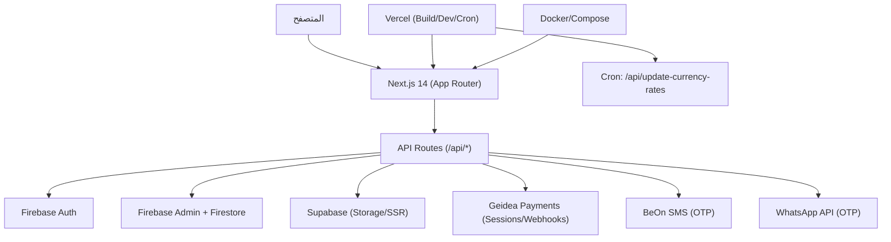

# تقرير مراجعة المشروع وخطة التصحيحيات (جاهز للإرسال بالإيميل)

مرحباً،

أدناه تقرير شامل مختصر وعملي عن حالة المشروع الحالية مقارنةً بقائمة التحقق المتفق عليها، يتضمن: توضيح الأسئلة، ما هو موجود حالياً، الفجوات، ثم خطة تصحيحيات مرتّبة حسب الأولوية.

## 1) سلايد 1 — معمارية المشروع

- السؤال: هل توجد معمارية صحيحة موثقة بمخطط عالي المستوى وقائمة تقنيات مناسبة، مع مراعاة الأداء والتوسع والاعتمادية وقابلية الاستخدام؟ وهل لدينا قيم SLA موثقة وخطة للوفاء بها؟

- الموجود حالياً (مختصر):
  - Next.js 14 (App Router) + TypeScript + Tailwind.
  - بنية API Routes متكاملة: مصادقة عبر Firebase Auth/Admin، قاعدة بيانات Firestore، تخزين/SSR عبر Supabase، مدفوعات Geidea، OTP عبر BeOn/WhatsApp.
  - جاهزية تشغيل عبر Docker/Vercel + مهمة مجدولة لتحديث أسعار العملات.

- الفجوات:
  - عدم وجود وثيقة معمارية رسمية موحّدة (Context/Container/Component).
  - لا توجد قيم SLA/SLO موثقة (زمن استجابة مستهدف، توافر، MTTR...).

- توصيات موجزة:
  - إعداد وثيقة معمارية عالية المستوى مع مبررات اختيار التقنيات وتدفقات البيانات.
  - تعريف SLA/SLO وخطة مراقبة وقياس لتحقيقها.

### مخطط معماري عالي المستوى (ملخّص)

## 2) Security & Compliance (الأمن والامتثال)

- السؤال: هل الأمن مُحكَم أثناء التخزين والنقل (HTTPS, CSP, وصول، تشفير/Tokenization/Anonymization)؟ وهل هناك امتثال للوائح مثل GDPR/DORA وتدقيق أمني مستقل؟

- الموجود حالياً:
  - نقل آمن عبر HTTPS ورؤوس أمان وCSP مُفعّلة.
  - مصادقة Firebase + نظام OTP، وفحص متغيرات البيئة عند التهيئة.
  - الاعتماد على تشفير مزوّدي الخدمة للتخزين (Firestore/Supabase).

- الفجوات:
  - لا يوجد Rate Limiting لمسارات OTP/الدفع.
  - سياسة الخصوصية والامتثال GDPR/DORA غير موثّقة كوثائق قانونية قابلة للتطبيق.
  - لا يوجد Tokenization/إخفاء لحقول حساسة على مستوى التطبيق (إن وُجدت).
  - لا يوجد تدقيق أمني خارجي مستقل.

- توصيات موجزة:
  - إضافة Rate Limiting وIP throttling لمسارات حساسة (OTP، الدفع، auth).
  - تشديد الـ CSP وتقليل 'unsafe-inline'/'unsafe-eval' قدر الإمكان.
  - إعداد سياسة خصوصية متوافقة مع GDPR، توثيق الاحتفاظ وحذف البيانات وعمليات DSAR.
  - مراجعة أمنية مستقلة + أدوات فحص SAST/DAST وSBOM.

## 3) Post-Launch Activities (ما بعد الإطلاق)

- السؤال: هل توجد إدارة حوادث، استراتيجية نشر تدريجي (canary/phase rollout)، توافق خلفي وإصدار قسري، وخطة تكيّف مع إصدارات الأنظمة؟

- الموجود حالياً:
  - صحة نظام أساسية (مسار health) وكرون لتحديث العملات.

- الفجوات:
  - لا Incident Playbook/Runbooks ولا منصة مراقبة/تنبيه (Sentry/Datadog...).
  - لا نشر مرحلي Canary/Phased ولا سياسة Versioning/Force Updates.
  - مصفوفة دعم المتصفحات غير موثقة.

- توصيات موجزة:
  - إعداد مراقبة وتنبيهات وخطة استجابة للحوادث (Roles/SLAs/قنوات).
  - تفعيل نشر مرحلي على Vercel وخطط تراجع Releases.
  - توثيق توافق خلفي وسياسة الإصدارات ودعم المتصفحات.

## 4) Optimizing the SDLC (تحسين دورة التطوير)

- السؤال: هل هناك CI/CD آلي مع اختبارات وحدات/تكامل، مراجعات يدوية، تحقق من مزودي الطرف الثالث، أدوات جودة مثل Sonar، وخطة نسخ احتياطي/تعافي كوارث؟

- الموجود حالياً:
  - نصوص npm للـ build/test موجودة؛ لا يوجد CI (Workflows) ولا اختبارات مُلتقطة حالياً.
  - دعم النشر عبر Vercel/Docker متاح.

- الفجوات:
  - لا CI/CD، لا Sonar/CodeQL، لا اختبارات وحدات/تكامل فعّالة.
  - لا سياسة نسخ احتياطي/تعافي كوارث موثّقة.

- توصيات موجزة:
  - إنشاء GitHub Actions: lint + type-check + unit/integration + build + artifact.
  - تفعيل SonarCloud وقياسات التغطية.
  - كتابة اختبارات تكامل للمدفوعات/OTP بمفاتيح اختبار.
  - وضع سياسة النسخ الاحتياطي وخطة DR.

## 5) Quality Assurance & Documentation (الجودة والتوثيق)

- السؤال: هل تُختبَر الحالات الطرفية والسلبية؟ وهل التوثيق شامل للكود والـ CI/CD والمنطق؟

- الموجود حالياً:
  - وثائق غنية (OTP/Geidea/تقارير إصلاحات ودروس).

- الفجوات:
  - لا خطة QA رسمية أو Test Plan موحّد.
  - صفحات اختبار يدوية بدل اختبارات آلية (E2E/Playwright).

- توصيات موجزة:
  - إعداد Test Plan يشمل سيناريوهات سلبية وحدود.
  - تحويل اختبارات يدوية إلى Playwright/Jest (E2E + وحدات).

## 6) الذكاء الاصطناعي في المنتج والعملية

- الموجود حالياً:
  - استخدام داخلي محدود (تحليلات/ملفات prompts). لا ميزات AI ظاهرة للمستخدم النهائي.

- توصيات موجزة:
  - في التطوير: مساعد مراجعة PR، توليد اختبارات ووثائق تلقائي.
  - في المنتج: توصية مطابقة لاعب-نادي، تلخيص رسائل، كشف احتيال المدفوعات (لاحقاً وبحذر امتثالاً للخصوصية).

---

## ملخص تنفيذي سريع

- نقاط القوة: بنية Next.js واضحة، تكاملات OTP/المدفوعات، دعم Docker/Vercel، رؤوس أمان وCSP، وثائق كثيرة.
- الثغرات الرئيسية: لا CI/CD ولا اختبارات، لا Sonar/CodeQL، لا Rate Limiting للمسارات الحساسة، لا سياسة خصوصية/امتثال رسمية، لا Incident Playbook/Monitoring، لا خطة نسخ/تعافي.

---

## خطة التصحيحيات مرتّبة حسب الأولوية

### أولوية P0 (أمن وتشغيل أساسي) — البدء فوراً خلال 3–7 أيام
1) إضافة Rate Limiting وIP Throttling لمسارات حساسة:
   - `/api/sms/*`, `/api/whatsapp/*`, `/api/geidea/*`, `/api/auth/*`.
2) CI/CD أولي على GitHub Actions:
   - خطوات: install → lint → type-check → unit tests (smoke) → build.
3) مراقبة وتنبيهات:
   - تفعيل Sentry/Logtail/Datadog، تسجيل أخطاء حرجة، تنبيه فوري على فشل Webhooks/OTP.
   - تم إضافة نقاط نهاية لوجينغ وتنبيهات أمنية: `/api/logs`, `/api/security-alerts`.
4) سياسة الخصوصية والامتثال (GDPR-ready):
   - وثيقة سياسة الخصوصية، الاحتفاظ والحذف، إجراءات طلبات المستخدم (DSAR).
5) تشديد CSP وتقليل 'unsafe-inline'/'unsafe-eval' قدر الإمكان.
6) أمن المدفوعات:
   - تحقق مشدد لتواقيع Webhook، معالجة Idempotency، إخفاء رسائل الخطأ.

### أولوية P1 (جودة واستقرار) — خلال 2–4 أسابيع
1) اختبارات وحدات/تكامل:
   - وحدات لـ `lib/*` ومسارات API الحرجة؛ تكامل للمدفوعات وOTP بمفاتيح اختبار.
2) SonarCloud/CodeQL:
   - قياسات جودة وتغطية وتقارير أمنية آلية ضمن الـ CI.
3) وثيقة معمارية رسمية + SLA/SLO:
   - مخطط C4 مبسّط، مقاييس الأداء، أهداف التوافر، MTTR وأدوات القياس.
4) Incident Playbook/Runbooks:
   - أدوار، قنوات اتصال، خطوات استعادة، خطة تراجع Releases.
5) نشر مرحلي على Vercel (Canary/Phased) + خطة Rollback.

### أولوية P2 (قابلية التوسع وDR وميزات AI) — خلال 4–8 أسابيع
1) سياسة نسخ احتياطي وتعافي كوارث (DR):
   - لبيانات Firestore/Supabase وملفات التخزين، اختبارات استعادة دورية.
2) تحسين قابلية التوسع:
   - آليات Retry/Circuit Breakers للخدمات الخارجية، Queue عند الحاجة.
3) AI في العملية والمنتج:
   - مساعد PR، توليد اختبارات/Docs؛ لاحقاً توصيات داخل المنتج.

---

## ملاحظات تنفيذية سريعة

- ابدأ بـ P0 ثم P1 ثم P2، مع تتبّع تقدّم أسبوعي.
- أي تغييرات أمنية على المدفوعات والـ OTP يجب اختبارها على بيئة Staging أولاً.
- تأكد من عدم تسريب أسرار في السجلات؛ عطّل أي تسجيلات حساسة في الإنتاج.

---

مع التحية،

محمد — تقرير المراجعة وخطة العمل

