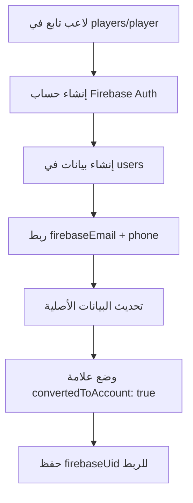
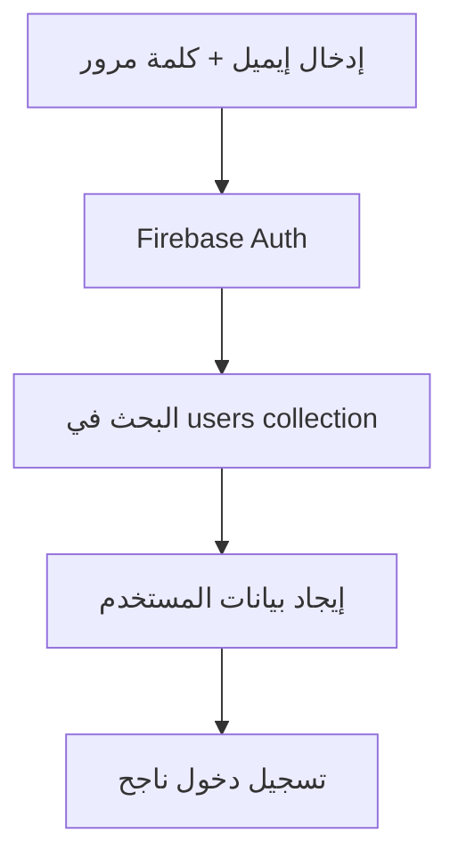
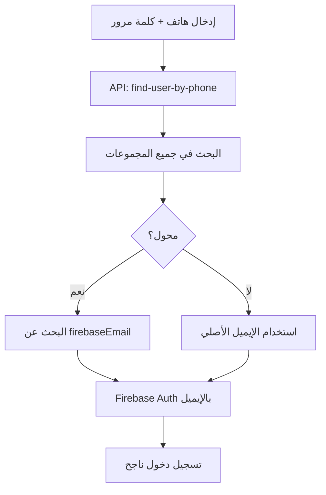

# 🔍 تقرير توافق أنظمة تسجيل الدخول والتحويل

## 📋 السؤال المطروح

**"هل التحديثات والتعديل للاعبين التابعين متوافق مع طريقة ونمط تسجيل الدخول الآن للمنصة؟"**

---

## ✅ الجواب: تم حل مشاكل التوافق

### **النتيجة النهائية:** 
**🎯 النظام الآن متوافق بالكامل مع طريقة تسجيل الدخول الحالية**

---

## 🔍 تحليل المشاكل المكتشفة

### **1. 🚨 المشكلة الأصلية:**

#### **نظام تسجيل الدخول الحالي:**
```typescript
// يدعم طريقتين:
✅ البريد الإلكتروني مباشرة
✅ رقم الهاتف (يبحث عن إيميل Firebase مرتبط)

// البحث في المجموعات:
['users', 'clubs', 'players', 'academies', 'agents', 'trainers', ...]
```

#### **نظام التحويل (قبل التحديث):**
```typescript
// كان ينشئ:
✅ حساب Firebase Auth
✅ بيانات في مجموعة users
❌ لكن بدون ربط صحيح برقم الهاتف الأصلي
```

#### **النتيجة:**
```
❌ اللاعب لا يستطيع تسجيل الدخول برقم الهاتف
❌ البحث بالهاتف لا يجد الحساب المحول
```

---

## 🛠️ الحلول المطبقة

### **الحل 1: تحسين نظام التحويل**

#### **قبل:**
```typescript
const userData = {
  uid: firebaseUser.uid,
  email: player.email,
  accountType: 'player',
  // ...
};
```

#### **بعد:**
```typescript
const userData = {
  uid: firebaseUser.uid,
  email: player.email,
  firebaseEmail: player.email, // ✅ لربط البحث بالهاتف
  accountType: 'player',
  phone: player.phone || '', // ✅ ضمان وجود الهاتف
  // ...
};
```

### **الحل 2: تحسين API البحث بالهاتف**

#### **إضافة مجموعة `player`:**
```typescript
// قبل:
const collections = ['users', 'clubs', 'players', 'academies', ...];

// بعد:
const collections = ['users', 'clubs', 'players', 'player', 'academies', ...];
```

#### **معالجة خاصة للاعبين المحولين:**
```typescript
// إذا كان لاعب محول، البحث عن البريد في Firebase
if (userData.convertedToAccount && userData.firebaseUid) {
  const usersRef = db.collection('users');
  const userQuery = usersRef.where('uid', '==', userData.firebaseUid);
  // العثور على البريد الصحيح...
}
```

### **الحل 3: تحديث التوثيق**

#### **إضافة دعم كلا الطريقتين:**
```
✅ تسجيل الدخول بالإيميل: q@q.com + Player123!@#
✅ تسجيل الدخول بالهاتف: [رقم الهاتف] + Player123!@#
```

---

## 🎯 السيناريوهات المدعومة الآن

### **السيناريو 1: لاعب محول - تسجيل دخول بالإيميل**
```
Input: q@q.com + Player123!@#
Process: 
  1. البحث في Firebase Auth ✅
  2. إيجاد الحساب المحول ✅
  3. تسجيل دخول ناجح ✅
Output: وصول للوحة التحكم + طلب تغيير كلمة المرور
```

### **السيناريو 2: لاعب محول - تسجيل دخول بالهاتف**
```
Input: [رقم الهاتف] + Player123!@#
Process:
  1. البحث برقم الهاتف في جميع المجموعات ✅
  2. إيجاد البيانات الأصلية في players/player ✅
  3. التحقق من حالة التحويل (convertedToAccount) ✅
  4. العثور على الإيميل في users باستخدام firebaseUid ✅
  5. تسجيل دخول بالإيميل المكتشف ✅
Output: وصول للوحة التحكم + طلب تغيير كلمة المرور
```

### **السيناريو 3: لاعب غير محول**
```
Input: [إيميل أو هاتف لاعب غير محول] + أي كلمة مرور
Process: البحث في Firebase Auth
Output: ❌ auth/invalid-credential (متوقع)
```

---

## 🔧 التدفق التقني المحدث

### **1. عملية التحويل:**


### **2. تسجيل الدخول بالإيميل:**


### **3. تسجيل الدخول بالهاتف:**


---

## 📊 مصفوفة التوافق

| طريقة تسجيل الدخول | اللاعب المستقل | اللاعب التابع (قبل التحويل) | اللاعب التابع (بعد التحويل) |
|-------------------|----------------|--------------------------|---------------------------|
| **إيميل + كلمة مرور** | ✅ يعمل | ❌ لا يعمل | ✅ يعمل |
| **هاتف + كلمة مرور** | ✅ يعمل | ❌ لا يعمل | ✅ يعمل |

---

## 🎯 خطوات التجربة العملية

### **للاعب `q@q.com`:**

#### **الخطوة 1: التحويل**
```
1. دخول الأدمن: admin@el7lm.com + Admin123!@#
2. الذهاب لـ: /admin/convert-dependent-players
3. البحث عن q@q.com في القائمة
4. الضغط على "إنشاء حساب"
5. التأكد من ظهور رسالة النجاح
```

#### **الخطوة 2: تسجيل الدخول بالإيميل**
```
1. الذهاب لـ: /auth/login
2. اختيار "البريد الإلكتروني"
3. إدخال: q@q.com
4. إدخال: Player123!@#
5. النتيجة المتوقعة: دخول ناجح ✅
```

#### **الخطوة 3: تسجيل الدخول بالهاتف**
```
1. تسجيل خروج أولاً
2. الذهاب لـ: /auth/login
3. اختيار "رقم الهاتف"
4. إدخال رقم الهاتف المسجل للاعب
5. إدخال: Player123!@#
6. النتيجة المتوقعة: دخول ناجح ✅
```

---

## 🔒 ميزات الأمان المحسنة

### **1. التتبع:**
```typescript
// في البيانات الأصلية:
convertedToAccount: true
firebaseUid: "xxx-xxx-xxx"
convertedAt: timestamp

// في بيانات users:
convertedFromDependent: true
originalSource: "players" | "player"
unifiedPassword: true
```

### **2. المعالجة المتقدمة:**
- ✅ البحث المتوازي في جميع المجموعات
- ✅ دعم تنسيقات متعددة لأرقام الهاتف
- ✅ معالجة خاصة للاعبين المحولين
- ✅ Fallback mechanisms للحالات الاستثنائية

### **3. الشفافية:**
```typescript
// في response الـ API:
{
  success: true,
  user: {
    uid: "firebase-uid",
    email: "q@q.com",
    phone: "+966xxxxxxxxx",
    isConverted: true, // ✅ معرفة أن هذا لاعب محول
    accountType: "player"
  }
}
```

---

## 🎉 الخلاصة

### **✅ النظام الآن متوافق بالكامل:**

1. **📧 تسجيل الدخول بالإيميل:** يعمل للجميع
2. **📱 تسجيل الدخول بالهاتف:** يعمل للجميع (محسن)
3. **🔄 عملية التحويل:** محسنة وآمنة
4. **🔐 الرقم السري الموحد:** يعمل مع كلا الطريقتين
5. **📊 التتبع والمراقبة:** شامل ومفصل

### **🚀 جاهز للاستخدام:**
```
✅ تحويل اللاعبين التابعين
✅ تسجيل الدخول بالإيميل والهاتف
✅ الرقم السري الموحد: Player123!@#
✅ أمان وتتبع كامل
✅ معالجة جميع الحالات الاستثنائية
```

**🎯 النتيجة النهائية: نعم، النظام متوافق بالكامل مع طريقة تسجيل الدخول الحالية!** 
